# FORTRESS — Multi-Chain, Multi-Vertical Architecture

> **Status:** Design proposal (target architecture).
> **Scope:** Evolve the working Base/EVM prompt-to-DeFi engine into a platform that scales across chains (Base, BNB, Sui, Solana) and verticals (yield → prediction markets, RWA, perps) with a single shared core and zero duplication.
> **Audience:** Engineering, security, and partners evaluating the platform.

---

## 1. TL;DR

FORTRESS turns a natural-language prompt into signable, pre-simulated transactions. Today it does this for **yield on Base**. This document defines the architecture that keeps **one planner, one API, one intent model, one APY/positions framework** while letting us add:

- **Chains** — Base (EVM), BNB (EVM), Solana (SVM), Sui (Move) — each in its native runtime.
- **Protocols** — Morpho/Aave/Pendle on Base, Venus on BNB, Kamino/MarginFi on Solana, Navi/Scallop on Sui — where a protocol on one chain need not exist on another.
- **Verticals** — yield today; prediction markets, RWA, perps next — each a first-class domain, not a bolt-on.

The design rests on **three decoupled planes** connected by a **chain-neutral Execution Plan (IR)** and wired by a **Capability Registry**:

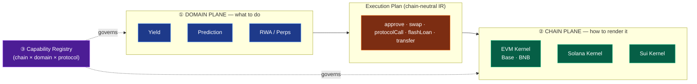

**The core principle:** *the "what" (domain) and the "where" (chain) are independent.* A yield deposit on Base and on Sui are the same business operation with different encoding. A prediction bet and a yield deposit on Base are different business operations with the same encoding. The architecture separates these so each grows on its own axis.

---

## 2. How the system works today (Base / EVM)

This is the current, production implementation on Base — the foundation we generalize from.

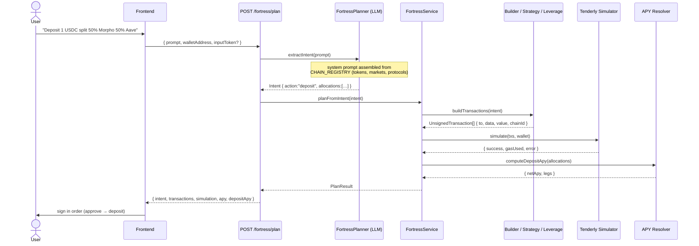

**The moving parts (current code):**

| Layer | File(s) | Role |
|-------|---------|------|
| Registry | `config/registry.ts` | Single source of truth: tokens, markets, `executable` flag, keyed by `chainId`. |
| Planner | `helpers/planner.ts` | LLM (temp 0, JSON). System prompt **data sections are generated from the registry**; behavioral rules are prose. Emits a Zod-validated `Intent`. |
| Intent | `types/intent.ts`, `types/strategy.ts`, `types/exit.ts` | Discriminated union on `action`: `deposit`, `swapAndDeposit`, `withdraw`, `rebalance`, `bridge`, `claimWithdraw`, `cancelWithdraw`, `strategy`, `leverage`, `refuse`. **Chain-agnostic business concepts.** |
| Orchestrator | `services/plan.service.ts` | `plan()` → planner → `planFromIntent()` → build → simulate → APY. Also `normalizeIntentAmount()` powers LLM-free re-simulation. |
| Builders | `helpers/builder.ts`, `services/strategy.service.ts`, `services/leverage.service.ts`, `services/exit.service.ts` | Encode EVM calldata (`encodeFunctionData`) into `UnsignedTransaction`. |
| Simulator | `helpers/simulator.ts` | Tenderly bundle simulation. |
| APY | `services/apy/*`, `services/apy/vault-apy.ts` | Rate resolver (Redis + Postgres, freshness-gated). Sources: `morpho-vault`, `aave-pool`, `compound-comet`, `defillama`, `pendle-implied`, `erc4626-onchain`. |
| Positions | `services/positions/*` | Discovery (Morpho GraphQL) + multicall reads + poller + net APY. |
| Contracts | `FortVault`, `FortStrategyExecutor` (+ adapters), `MorphoLeverageExecutor`, `MorphoExitExecutor` | On-chain execution. |

**Why the same prompt list works across so many shapes** (from `Prompts.md`): every prompt collapses to one `Intent`, and the orchestrator routes by `intent.action`. "Deposit 1 USDC to Morpho" → `deposit`; "Loop cbETH/USDC 3x" → `strategy`; "Open 2x leverage on cbETH" → `leverage`; "Withdraw all from Aave" → `withdraw`. One pipeline, many verbs.

**What is already chain-agnostic and reusable as-is:** the intent model, the planner shell, the registry concept, the APY resolver framework, the positions framework, the API/controllers/auth, saved-strategies, suggestions, and the LLM-free simulate path.

**What is currently EVM-coupled** (and must move behind an interface): the builders (`encodeFunctionData`), the Tenderly simulator, the protocol services (`morpho.service`, `pendle.service`, `swap-resolver`/LiFi), `pricing.ts` (oracle `eth_call`), `abi.ts`, and the contract-address `config.ts`.

---

## 3. The three growth axes

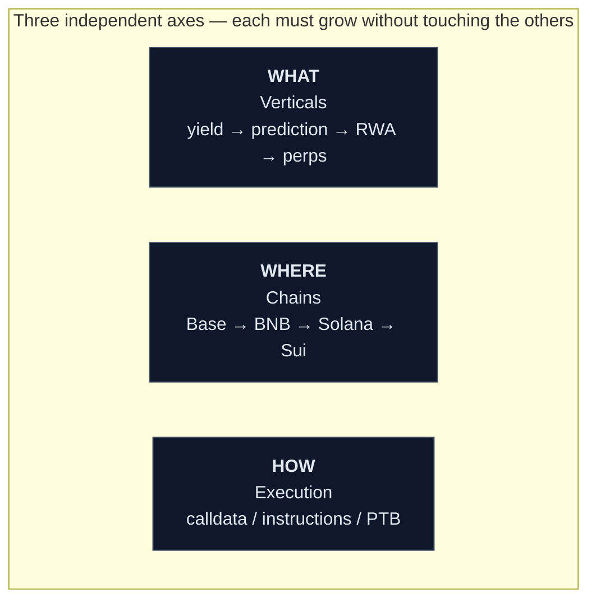

A naive design couples these (e.g. one giant `intent` enum + per-chain copies of every builder). That produces O(chains × protocols × verticals) code. The target architecture makes the cost **additive**: a new chain is one kernel, a new protocol is one driver + one registry entry, a new vertical is one domain module.

---

## 4. Target architecture — three planes + IR

### 4.1 Component view

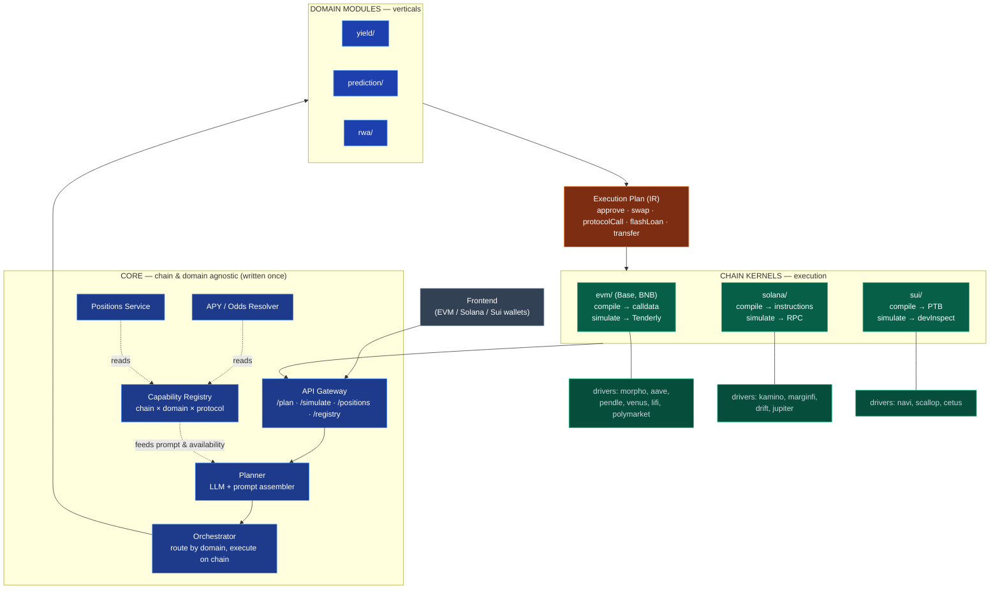

### 4.2 The interface contracts

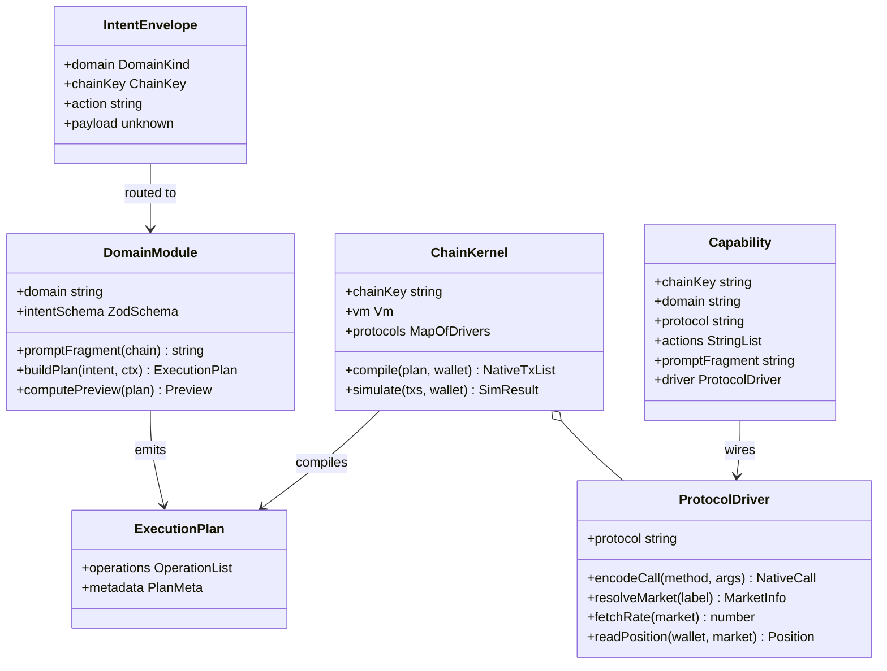

### 4.3 The Execution Plan (IR) — the linchpin

The IR is the chain-neutral vocabulary domains speak and kernels compile. Keeping it minimal but complete is the single most important design decision.

```typescript
type ExecutionPlan = {
  operations: Operation[];
  metadata: { description: string; preview?: Preview }; // apy, odds, ltv…
};

type Operation =
  | { op: "approve";      token: Asset; spender: Ref;  amount: Amount }
  | { op: "swap";         from: Asset;  to: Asset;     amount: Amount; minOut: Amount; routeHint?: unknown }
  | { op: "protocolCall"; protocol: string; method: string; args: Record<string, unknown> }
  | { op: "flashLoan";    asset: Asset; amount: Amount; inner: Operation[] }
  | { op: "transfer";     token: Asset; to: Ref;       amount: Amount };
```

Rationale for exactly these five:

| Operation | Universal because… | Yield | Prediction | RWA |
|-----------|--------------------|:-----:|:----------:|:---:|
| `approve` | every VM has a spend-authorization primitive (EVM allowance, SVM token approve/delegate, Move coin split) | ✔ | ✔ | ✔ |
| `swap` | every chain has a DEX aggregator (LiFi, Jupiter, Cetus) | ✔ | ✔ | ✔ |
| `protocolCall` | the escape hatch — the **driver** encodes protocol-specific methods; the kernel never hardcodes a protocol | supply/borrow | buy/sell/claim | mint/redeem |
| `flashLoan` | atomic-leverage / unwind wrapper; kernels that lack it reject plans using it | leverage/exit | — | — |
| `transfer` | move residuals / settle | ✔ | ✔ | ✔ |

A prediction "buy YES" is a `protocolCall` to the market contract. An RWA "mint" is a `protocolCall` to the issuer. **New verticals need no new IR ops** — they compose existing ones and delegate specifics to a driver.

### 4.4 Chain identity

EVM's numeric `chainId` is not universal (Solana, Sui have no `chainId`). We generalize to a **`chainKey`** string (`"base"`, `"bnb"`, `"solana"`, `"sui"`) with a namespaced descriptor, keeping the EVM `chainId` where it applies:

```typescript
type ChainRef =
  | { vm: "evm";  chainKey: "base" | "bnb"; chainId: 8453 | 56 }
  | { vm: "svm";  chainKey: "solana"; cluster: "mainnet-beta" }
  | { vm: "move"; chainKey: "sui"; network: "mainnet" };
```

The `NativeTransaction` returned to the frontend carries `vm` so the signer knows how to submit it:

```typescript
type NativeTransaction = {
  chainKey: string;
  vm: "evm" | "svm" | "move";
  label: string;          // "approve USDC", "supply to Navi" — for the UI
  raw: unknown;           // evm:{to,data,value} | svm:{instructions} | move:{ptb}
};
```

---

## 5. The Capability Registry — governing the sparse matrix

Not every protocol exists on every chain, and not every vertical applies to every chain. The registry is the **single source of truth** for "what is possible where," and it drives three things: (1) planner prompt assembly, (2) orchestrator routing, (3) refusals for unsupported combinations.

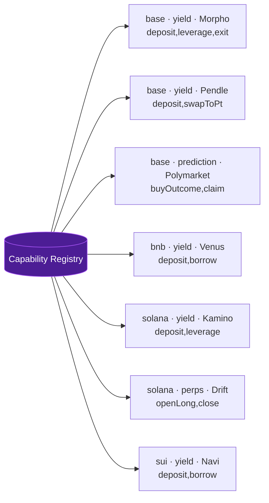

**Support matrix (illustrative target):**

| domain / chain | Base (EVM) | BNB (EVM) | Solana (SVM) | Sui (Move) |
|---|---|---|---|---|
| yield · lend | Morpho, Aave, Fluid, Euler, Compound, Pendle | Venus, Aave, Alpaca | Kamino, MarginFi, Save | Navi, Scallop, Bucket |
| yield · leverage | Morpho (flash) | Venus | Kamino | Navi |
| yield · swap | LiFi | LiFi / PancakeSwap | Jupiter | Cetus / Aftermath |
| prediction | Polymarket | — | Drift BET / Aver | — |
| perps | — | — | Drift, Jupiter Perps | — |
| rwa | Ondo, Superstate | — | Ondo (SVM) | — |

A user prompt "leverage on Kamino" resolves to Solana because the registry only registers Kamino under `solana`. The planner never offers Kamino on Base; the orchestrator refuses cleanly if asked. **The matrix being sparse is a feature, encoded as data.**

---

## 6. Prompt assembly — chain + domain fragments

Your requirement: *"chain prompt is something added to the system prompt and then with the main message gets processed."* The architecture generalizes this to **composable prompt fragments** owned by domains and capabilities.

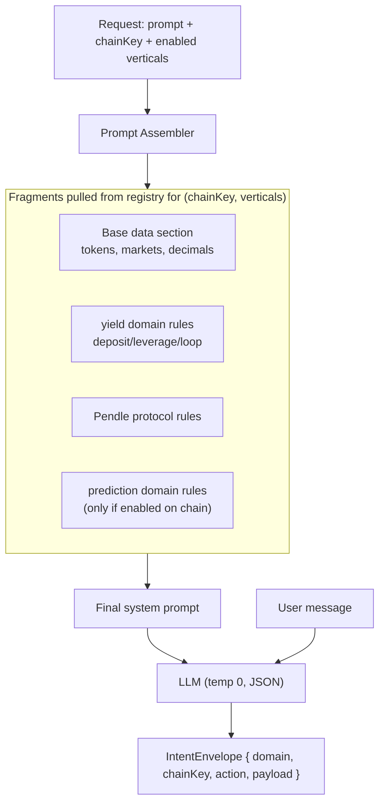

- The **data section** (tokens/markets/decimals) is generated from the registry — exactly as `planner.ts` does today with `CHAIN_REGISTRY`.
- Each **domain module** contributes a `promptFragment(chain)` describing its verbs and rules.
- Each **capability** contributes a protocol-specific fragment (e.g. Pendle market labels, Polymarket phrasing).
- Fragments are concatenated **only for the target chain and enabled verticals**, so the prompt stays small and the LLM never sees irrelevant chains/protocols.

This is a direct evolution of the current `buildPlannerSystemPrompt(chain, protocolList)` — we add domain and capability fragments to the same assembly step.

---

## 7. End-to-end request lifecycle (target)

Same API, same response shape, regardless of chain or vertical.

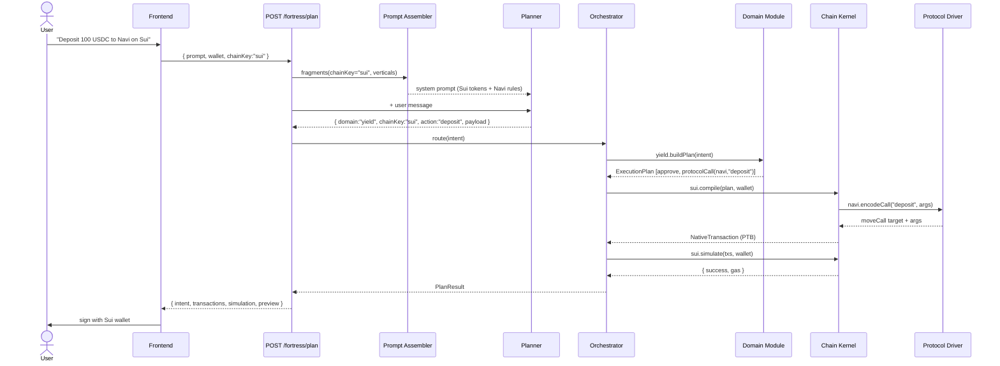

**The orchestrator is tiny and domain/chain-agnostic:**

```typescript
class Orchestrator {
  constructor(
    private domains: Map<string, DomainModule>,
    private kernels: Map<string, ChainKernel>,
  ) {}

  async plan(intent: IntentEnvelope, wallet: string): Promise<PlanResult> {
    const domain = this.domains.get(intent.domain);
    const kernel = this.kernels.get(intent.chainKey);
    if (!domain || !kernel) throw new UnsupportedError(intent);

    const plan = await domain.buildPlan(intent, { kernel, registry });
    const txs  = await kernel.compile(plan, wallet);
    const sim  = await kernel.simulate(txs, wallet);
    const preview = await domain.computePreview?.(plan);
    return { intent, transactions: txs, simulation: sim, preview };
  }
}
```

Adding a chain or vertical never edits this class — it only registers a new `kernel` or `domain`.

---

## 8. Worked examples across chains & verticals

### 8.1 Base (EVM) — yield deposit *(works today)*

Prompt: **"Deposit 1 USDC split 50% Morpho 50% Aave"**

```
Intent   { domain:"yield", chainKey:"base", action:"deposit",
           payload:{ amount, allocations:[{Morpho,5000},{Aave,5000}] } }
Plan     [ approve(USDC → FortVault, 1e6),
           protocolCall(fortVault,"deposit",{entries}) ]
EVM      encodeFunctionData(fortVaultAbi,"deposit") → { to:vault, data, value:0 }
Simulate Tenderly bundle → success
```

### 8.2 BNB (EVM) — reuses the EVM kernel

Prompt: **"Deposit 1 USDC to Venus on BNB"**

```
Intent   { domain:"yield", chainKey:"bnb", action:"deposit", payload:{ amount, protocol:"Venus" } }
Plan     [ approve(USDC → Venus vToken), protocolCall(venus,"mint",{amount}) ]
EVM      same compiler; driver = chains/evm/protocols/venus.ts; addresses = config/bnb.ts
Simulate Tenderly (BNB supported) → success
```

> BNB is ~90% shared with Base: same EVM kernel, compiler, simulator, and LiFi swap driver. The delta is **one config file (addresses) + protocol drivers (Venus, PancakeSwap) + registry entries.**

### 8.3 Solana (SVM) — leverage

Prompt: **"Open 2x leverage on SOL with 50 USDC on Kamino"**

```
Intent   { domain:"yield", chainKey:"solana", action:"leverage", payload:{ mult:2, collateral:"SOL", equity } }
Plan     [ flashLoan(USDC, 50e6, inner:[
             swap(USDC → SOL via Jupiter),
             protocolCall(kamino,"deposit",{...}),
             protocolCall(kamino,"borrow",{...}) ]) ]
SVM      compile → TransactionInstruction[] (Jupiter ix + Kamino ix); versioned tx + LUTs
Simulate connection.simulateTransaction → success
```

> The **yield domain module emits the identical `flashLoan → swap → deposit → borrow` shape** it does for Base leverage. The Solana kernel compiles it into instructions; the EVM kernel compiles it into a `MorphoLeverageExecutor` call. Same "what," different "how."

### 8.4 Sui (Move) — supply + borrow

Prompt: **"Supply 100 USDC to Navi and borrow SUI at 40% LTV"**

```
Intent   { domain:"yield", chainKey:"sui", action:"strategy", payload:{ steps:[supply, borrow] } }
Plan     [ protocolCall(navi,"supply",{coin:USDC, amount}),
           protocolCall(navi,"borrow",{asset:SUI, ltv:0.4}) ]
Move     compile → ProgrammableTransactionBlock (splitCoins + moveCall navi::lending::supply/borrow)
Simulate sui.devInspectTransactionBlock → success
```

### 8.5 Prediction market (new vertical) — no chain kernel changes

Prompt: **"Buy 10 USDC of YES on 'BTC > 100k by Dec' on Polymarket"**

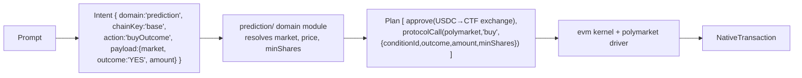

> Adding prediction markets = **one domain module** (`domains/prediction/`) + **one driver** (`chains/evm/protocols/polymarket.ts`) + registry entries. The yield module, the EVM kernel, and every other chain are untouched. Odds/settlement live in the domain's `computePreview`, resolved by the same APY/positions framework generalized to "positions & payoffs."

---

## 9. Directory structure

```
src/
├─ core/                          SHARED — never chain- or domain-specific
│  ├─ planner/
│  │  ├─ planner.ts               LLM call
│  │  ├─ prompt-assembler.ts      registry + domain + capability fragments → system prompt
│  │  └─ intent-envelope.ts       { domain, chainKey, action, payload } + Zod
│  ├─ orchestrator.ts             route by domain → build IR → compile+simulate on kernel
│  ├─ registry/
│  │  ├─ capabilities.ts          the (chain × domain × protocol) table
│  │  ├─ chains.ts                chainKey, vm, tokens, markets, executable
│  │  └─ index.ts                 lookups, availability, prompt-fragment collection
│  ├─ ir/                         ExecutionPlan, Operation, Asset, Amount, Ref
│  ├─ services/
│  │  ├─ apy/                     rate/odds resolver (dispatch to capability.fetchRate)
│  │  ├─ positions/               positions/payoffs (dispatch to capability.readPosition)
│  │  └─ saved-strategies/
│  └─ api/                        Fastify routes, controllers, auth, rate-limit, serializers
│
├─ domains/                       VERTICALS — business logic, emit IR
│  ├─ yield/                      ← current fortress logic, extracted
│  │  ├─ intents.ts               deposit, withdraw, strategy, leverage, exit
│  │  ├─ prompt-fragment.ts
│  │  ├─ resolver.ts              market lookup, borrow sizing, APY math
│  │  └─ plan-builder.ts          Intent → ExecutionPlan
│  ├─ prediction/                 ← future
│  ├─ perps/                      ← future
│  └─ rwa/                        ← future
│
├─ chains/                        EXECUTION — compile IR → native, simulate
│  ├─ types.ts                    ChainKernel, ProtocolDriver, NativeTransaction
│  ├─ evm/
│  │  ├─ kernel.ts                compile → calldata; simulate → Tenderly
│  │  ├─ compiler.ts              Operation → encodeFunctionData
│  │  ├─ protocols/               morpho, aave, fluid, euler, compound, pendle, venus, pancake, lifi, polymarket
│  │  ├─ abi.ts
│  │  └─ config/{base,bnb}.ts     contract addresses per EVM chain
│  ├─ solana/
│  │  ├─ kernel.ts                compile → instructions; simulate → RPC
│  │  ├─ compiler.ts
│  │  ├─ protocols/               kamino, marginfi, drift, jupiter
│  │  └─ config.ts
│  └─ sui/
│     ├─ kernel.ts                compile → PTB; simulate → devInspect
│     ├─ compiler.ts
│     ├─ protocols/               navi, scallop, cetus
│     └─ config.ts
│
└─ index.ts                       boot: register kernels + domains + capabilities, wire API
```

**How today's Base code maps in** (a move, not a rewrite):

| Today | New home | Note |
|-------|----------|------|
| `helpers/planner.ts` | `core/planner/` | prompt assembler generalized |
| `types/intent.ts`,`strategy.ts`,`exit.ts` | `domains/yield/intents.ts` | yield-domain schema |
| `services/strategy.service.ts`,`leverage.service.ts`,`exit.service.ts` | `domains/yield/plan-builder.ts` | emit IR instead of calldata |
| `helpers/builder.ts`,`strategy-builder.ts` | `chains/evm/compiler.ts` | IR → calldata |
| `helpers/simulator.ts` | `chains/evm/kernel.ts` | Tenderly |
| `services/morpho.service.ts`,`pendle.service.ts`,`swap-resolver.ts` | `chains/evm/protocols/*` | drivers |
| `utils/config.ts`,`abi.ts` | `chains/evm/config/base.ts`,`abi.ts` | EVM-only |
| `config/registry.ts` | `core/registry/chains.ts` | extended to all chains |
| `services/apy/*`,`positions/*` | `core/services/*` | stay shared, dispatch via capabilities |

---

## 10. Migration roadmap

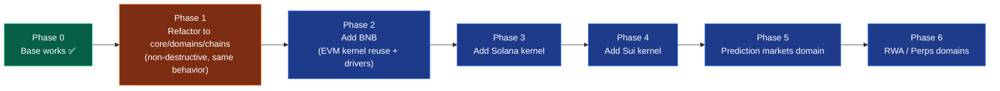

1. **Phase 1 — Structural (safe, no behavior change).** Move shared code to `core/`, EVM code to `chains/evm/`, yield logic to `domains/yield/`. Introduce the IR and the `ChainKernel`/`DomainModule` interfaces; the EVM kernel wraps the existing builder/strategy/leverage/exit code. The full `Prompts.md` list keeps passing. Ship before any non-EVM code exists.
2. **Phase 2 — BNB.** New config + Venus/PancakeSwap drivers + capabilities. Re-run the prompt suite against BNB protocols.
3. **Phase 3 — Solana.** New kernel (instructions + `simulateTransaction`), Jupiter/Kamino/MarginFi drivers. Yield module unchanged.
4. **Phase 4 — Sui.** New kernel (PTB + `devInspect`), Navi/Scallop/Cetus drivers.
5. **Phase 5 — Prediction markets.** New domain module + Polymarket/Drift-BET drivers.
6. **Phase 6 — RWA / Perps.** New domain modules; reuse existing kernels.

---

## 11. Frontend — one flow, chain-aware signing

The frontend already treats transactions as opaque and signs them in order. It becomes a thin switch on `vm`:

```typescript
async function sign(tx: NativeTransaction) {
  switch (tx.vm) {
    case "evm":  return sendEvmTx(tx.raw);        // wagmi
    case "svm":  return sendSolanaTx(tx.raw);     // @solana/wallet-adapter
    case "move": return signSuiTx(tx.raw);        // @mysten/dapp-kit
  }
}
```

The plan/preview/positions API responses keep the exact same envelope; only the wallet connector differs per chain.

---

## 12. APY / odds & positions across chains

Both services stay in `core/` and **dispatch to capability-provided readers**, so caching/freshness/DB logic is written once:

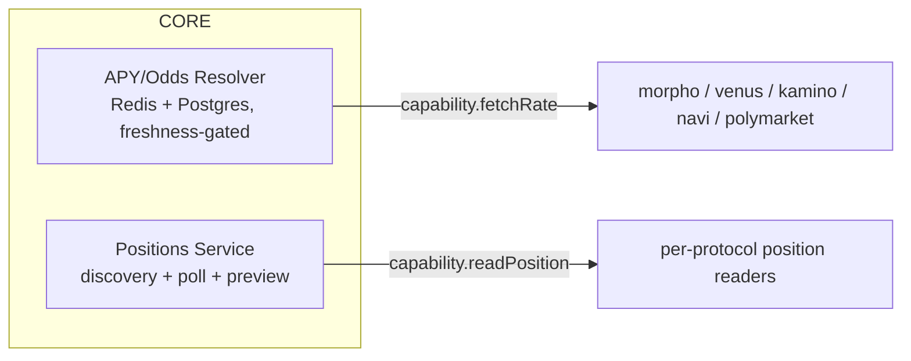

- Yield rate → protocol driver (`erc4626-onchain`, `compound-comet`, `pendle-implied`, DefiLlama, on-chain sampling — all already implemented for Base).
- Prediction "rate" → market odds/implied probability via the Polymarket driver.
- Positions generalize from `{collateral, debt, ltv}` to a domain-tagged shape (`{outcome, shares, resolved}` for predictions).

---

## 13. Production practices baked in

| Concern | Mechanism |
|---------|-----------|
| **Pre-execution safety** | Every plan is simulated on its chain (Tenderly / RPC simulate / devInspect) before it reaches the user. No blind signing. |
| **Never-fabricate** | Rates/odds are freshness-gated; unavailable → withheld (`null`), never guessed. |
| **Determinism** | Planner runs at temperature 0, JSON mode, Zod-validated. Invalid or unsupported → clean refusal with suggestions. |
| **Binding input token** | Optional `inputToken` rejects plans that don't start from what the user holds. |
| **LLM-free re-simulation** | `/simulate` rescales an existing intent (no OpenAI cost) — extends per chain. |
| **Isolation / blast radius** | A Solana driver bug cannot affect Base; a prediction bug cannot affect yield. Faults are contained to a module. |
| **Upgradeability** | EVM executors are UUPS; drivers are versioned and independently deployable. |
| **Auditability** | Structured per-request logging (`FortressLogger`) at every stage; capability registry is introspectable (auto-docs, "what's supported"). |
| **Idempotent schema** | Services create their own tables; wallet-scoped DB writes. |
| **Testing** | Contract fork tests per chain; IR golden tests (intent → expected plan); per-kernel compile tests (plan → native tx); the `Prompts.md` suite as an integration gate per chain. |

---

## 14. Extension playbooks

**Add a chain (e.g. Aptos):**
1. `chains/aptos/kernel.ts` implementing `ChainKernel` (compile → Move txn, simulate).
2. Protocol drivers under `chains/aptos/protocols/`.
3. Register capabilities + a `chains.ts` entry. Planner auto-includes Aptos.

**Add a protocol on an existing chain (e.g. Aave on BNB):**
1. Driver `chains/evm/protocols/aave.ts` (reuse Base logic, BNB addresses).
2. Register capability `{ chainKey:"bnb", domain:"yield", protocol:"Aave", actions:[…] }`.

**Add a vertical (e.g. prediction markets):**
1. `domains/prediction/` — intents, prompt fragment, resolver, plan-builder.
2. Drivers where the markets live (`chains/evm/protocols/polymarket.ts`).
3. Register capabilities. Orchestrator, kernels, and other domains untouched.

None of these edit the orchestrator, the API, the planner shell, or any unrelated module.

---

## 15. Non-goals & honest tradeoffs

- **IR leakage is the main risk.** If the IR drifts toward EVM semantics, non-EVM kernels strain to compile it. Mitigation: keep the five ops abstract; anything protocol-specific goes through `protocolCall` + driver, never a new op.
- **Cross-chain atomicity** (e.g. "leverage on Base using collateral bridged from Solana") is explicitly **out of scope** for v1 — each plan targets one chain. Bridging remains a discrete `bridge` action.
- **Non-EVM simulation fidelity** is lower than Tenderly's EVM tracing; Solana/Sui use native dry-runs, which are sufficient for revert detection but less rich. We surface this in the preview.
- **Upfront cost.** Phase 1 (the refactor + IR) is real engineering with no user-visible feature. It is the price of additive growth thereafter — and it is non-destructive, so Base keeps shipping throughout.

---

## 16. Summary

One planner, one intent envelope, one API, one APY/positions framework — **written once in `core/`.** Chains plug in as **kernels**, protocols as **drivers**, verticals as **domain modules**, all wired by a **capability registry** and connected through a **chain-neutral Execution Plan**. Base is the reference kernel; BNB reuses it; Solana and Sui add kernels; prediction markets and RWA add domains. Growth is additive on three independent axes, with simulation-before-signing and never-fabricated data as non-negotiable production invariants.
